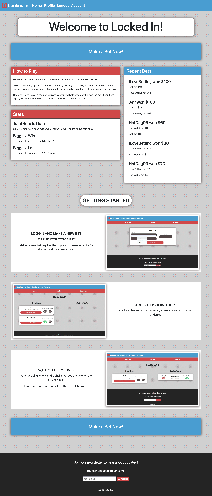
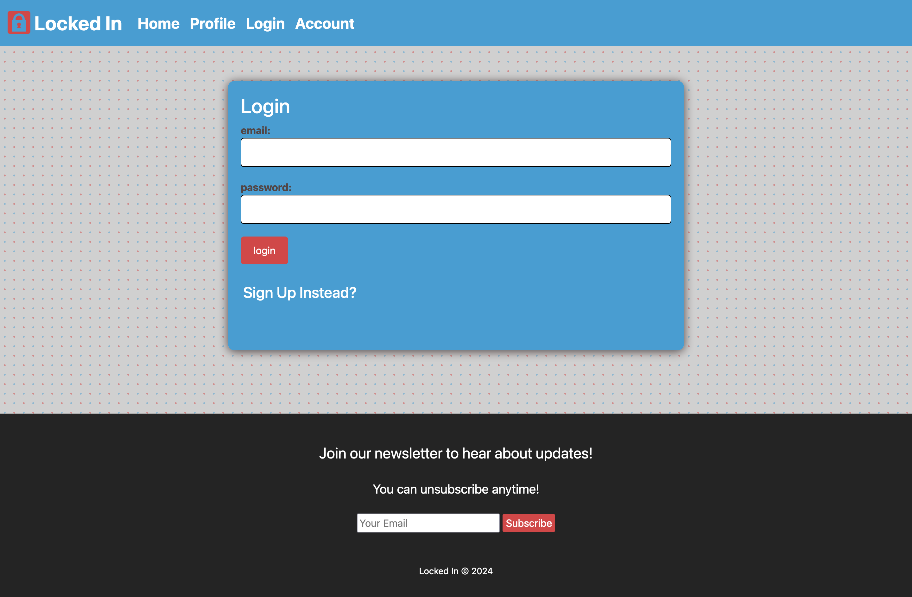
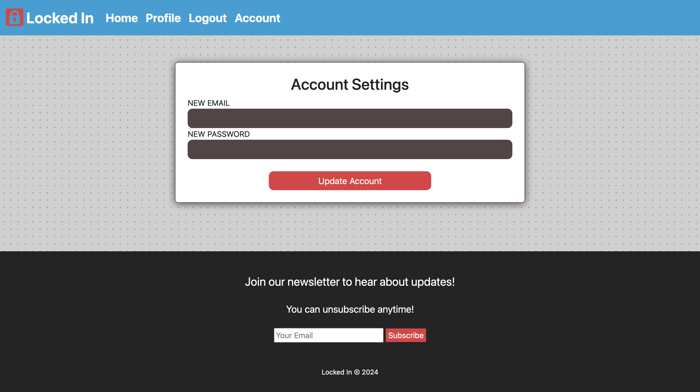
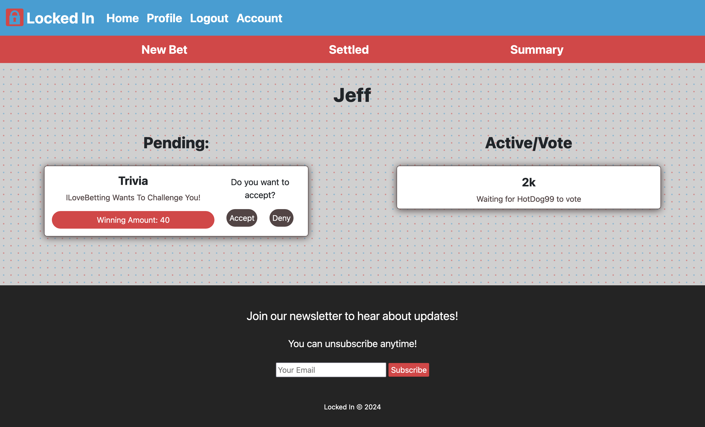
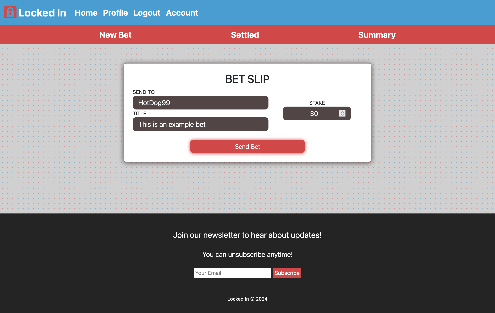

# Locked In

## Description

Locked In is a casual betting web app. It allows users to make bets with their friends and keep track of who wins. Unlike other betting apps where users bet on sports or other specific events, Locked In allows users to make bets on anything they want.

## Features

* Betting system that allows users to:
    * Propose bets to other users
    * Accept (or decline) bets from other users
    * Vote on the winner of accepted bets
    * View information about bets
* User accounts that allow users to:
    * Sign up for an account
    * Log in to an account
    * Change the email and password associated with their account

## Technologies Used

* HTML, CSS, JavaScript (basic web technologies)
* Bootstrap (CSS framework)
* Node.js (Backend JavaScript platform)
* Express.js (Web server)
* Handlebars.js (Web template system)
* MySQL (RDBMS)
* Sequelize (ORM)
* Other npm modules:
    * brcrypt (password hashing)
    * connect-session-sequelize (session management)
    * dotenv (environment variables)
    * express-session (session management)

## Installation

There is no installation needed to use the app. Simply visit the deployed app at https://rocky-island-80109-07f4dc58686b.herokuapp.com/, or visit a local deployment if you have one.

To deploy locally/install the server, clone the project's GitHub repository to your machine, navigate to the project directory, and run `npm i` in your terminal. Once the packages install, run `npm run seed` to seed the project database, and `npm start` to start the server. You will need to provide environment variables in a `.env` file to correctly configure the Sequelize connection to the database. Once the server is running, it will print the port it is listening on in the command line. You can navigate to `http://localhost/[PORT]` in your web browser to connect to your local server.

## Usage

Visit the homepage at `/` to see general information about the app:

Visit the login and signup pages by clicking on the buttons on the homepage, or by visiting the login tab in the navbar. Use the signup page to sign up for an account, and the login page to log in to your account:

Visit the acconut page to change your email or password:

Visit the profile page to view information about your bets, accept or decline bets, to vote on bets, and to create new bets:

## Credits

The contributors to this project are: Ayo Okediji ([GitHub](https://github.com/Ayotheman12)), Joel Teleha ([GitHub](https://github.com/jteleha)), Noah Fryman ([GitHub](https://github.com/noah-10)), and Spencer Surface ([GitHub](https://github.com/SpencerSurface)).

Ayo worked on the user routes and the bet page.

Joel worked on the home routes, login/signup/account pages, and the profile summary page.

Noah worked on the vote routes and the profile pages.

Spencer worked on the bet routes, the page layout, and the homepage.

All code was written by ourselves unless otherwise noted. A number of files were patterned in whole or in part on files provided by edX Boot Camps LLC. Notably `server.js` and especially `config/connection.js` have been modified very little due to their boilerplate nature.